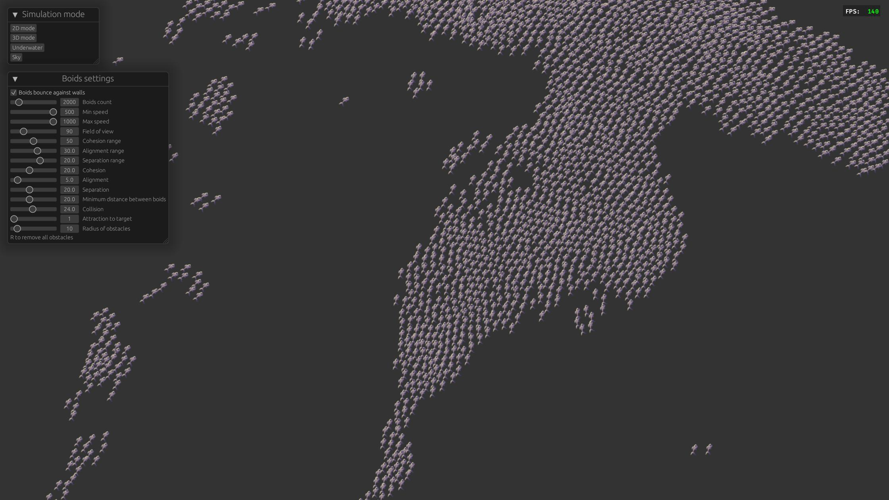
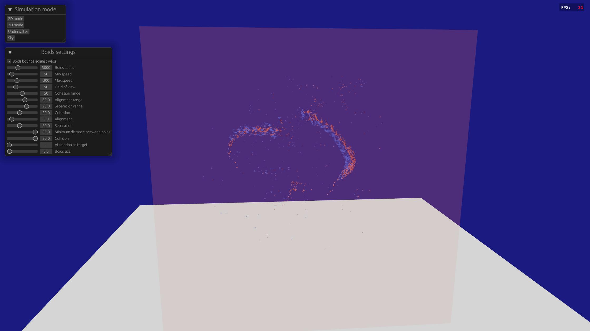
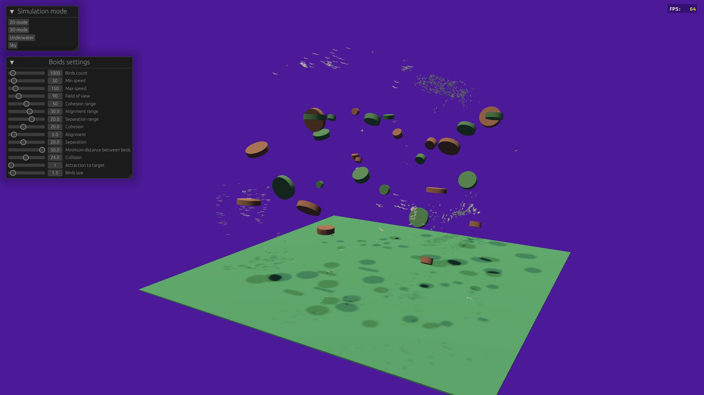
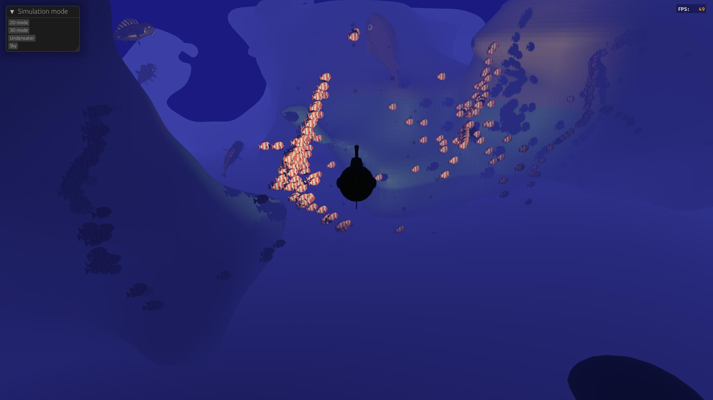

# Boidsy

Interactive boids simulation in 2D and 3D using Bevy and Rust

<p align="center">
  
</p>

---

## 📖 About

**Boidsy** is a real-time 2D and 3D boid (flocking) simulation powered by [Bevy](https://bevyengine.org/) and [Rust](https://www.rust-lang.org/).  
It showcases emergent behavior through simple local rules such as **alignment**, **cohesion**, and **separation**, rendered efficiently using a modern ECS-based engine.

This project was developed as part of the **"Projet 3D"** teaching unit at the **University of Montpellier**, during the **Master 2 IMAGINE** program.

---

## ✨ Features

- 🚀 Real-time 2D and 3D boid simulations
- 🧠 Emergent flocking behavior (alignment, cohesion, separation)
- 🎛️ Extensive control over scene parameters via integrated UI
- 🎮 Smooth camera controls and scene transitions
- ⚡ Good performance, leveraging Bevy ECS and rendering systems
- 🌊 Underwater scene using marching cubes algorithm for terrain generation

---

## 🛠 Built with

- [Bevy](https://bevyengine.org/) - Game engine (v0.12)
- [bevy_egui](https://github.com/mvlabat/bevy_egui) - UI integration (v0.24)
- [bevy_spatial](https://github.com/StarArawn/bevy_spatial) - k-d tree (v0.7)
- [noise](https://docs.rs/noise/latest/noise/) - Perlin noise generation

---

## 🛠️ Prerequisites

- **Rust** 1.70.x – 1.75.x (required for Bevy 0.12.0)  
- **Cargo** (comes bundled with Rust)

Install Rust easily with [rustup.rs](https://rustup.rs/) if you haven't already!

---

## 🚀 Installation

Clone the repository, build, and run:

```bash
git clone https://github.com/louis-jean0/boidsy.git
cd boidsy
cargo build --release
cargo run --release
```

(Using --release is recommended for best performance)

---

## 🎮 Controls

| Scene                  | Action                       | Key(s)                          |
|:------------------------|:------------------------------|:---------------------------------|
| 2D scene                | Control predator              | Left click                      |
|                         | Add obstacles                 | Right click                     |
| 3D scene                | Move camera                   | `Z`, `Q`, `S`, `D` (AZERTY) or `W`, `A`, `S`, `D` (QWERTY) |
|                         | Grab/Release mouse            | `E`                             |
| Sky scene               | Move camera                   | `Z`, `Q`, `S`, `D`               |
|                         | Add obstacles (at camera pos) | Left click                      |
|                         | Grab/Release mouse            | `E`                             |
| Underwater scene        | Move camera (submarine)        | `Z`, `Q`, `S`, `D`               |
|                         | Move vertically (up/down)     | `Space` (up), `Shift` (down)     |
|                         | Grab/Release mouse            | `E`                             |

---

## 🖼️ Screenshots
<p align="center">   </p> <p align="center">   </p>


## 👥 Contributors

- [Louis Jean](https://github.com/louis-jean0)
- [Benjamin Serva](https://github.com/bserva34)

## 📝 License

This project is licensed under the [MIT License](LICENSE).